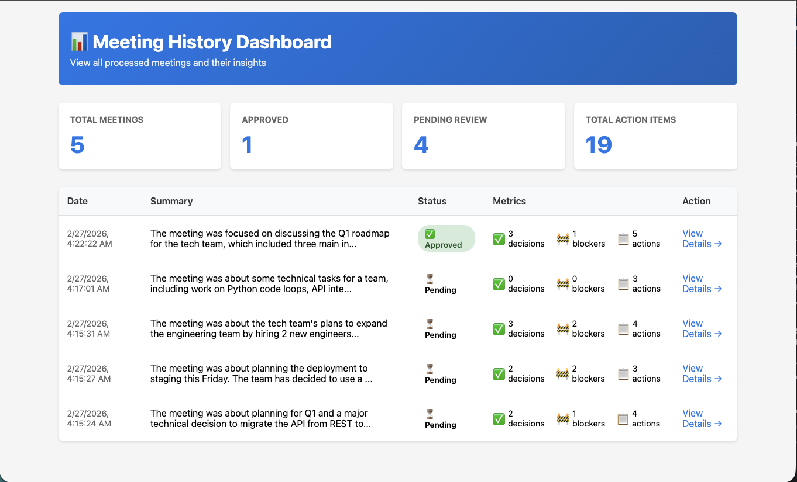
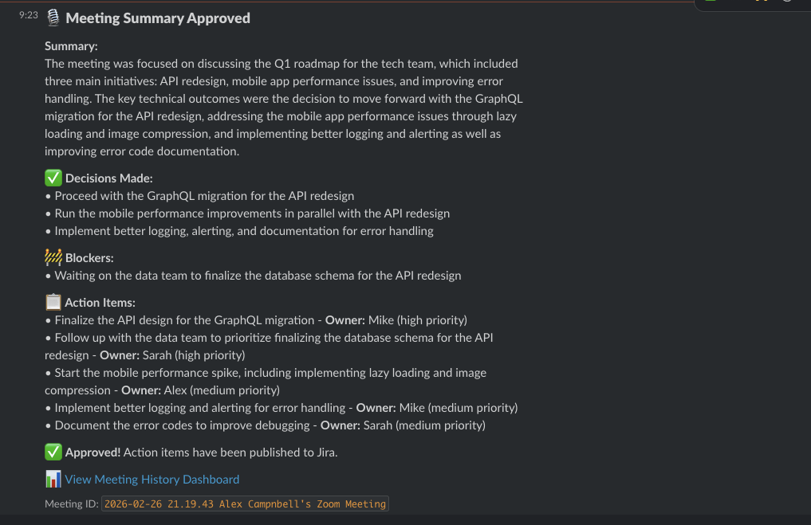
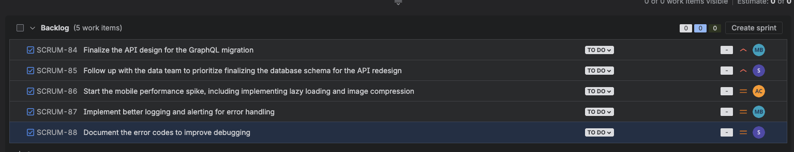

# Aldeas: AI Meeting Companion

**Article Title:** AIdeas: AI Meeting Companion - Turn Meeting Chaos into Execution

**Cover Image:** 


**Tags:** #aideas-2025 #workplace-efficiency #NAMER

---

## App Category

**Workplace Efficiency**

The AI Meeting Companion directly addresses workplace efficiency by automating the post-meeting workflow: manual note-taking, action item tracking, and ticket creation.

---

## My Vision

### What's the Problem?

Teams spend significant time in meetings, yet outcomes are often forgotten, inconsistently documented, or manually translated into follow-up work. A typical workflow looks like:

1. Meeting ends
2. Someone manually writes notes (and maybe can't even keep up missing other important assignments)
3. Notes are shared (or lost)
4. Action items are unclear or forgotten
5. Jira tickets are created days later (or never)
6. Team members don't know what they're responsible for

### What I Built

**AI Meeting Companion** is a serverless, event-driven system that automatically transforms meeting recordings into structured, actionable insights. Here's what it does:

1. **Ingests** meeting recordings from Zoom
2. **Transcribes** audio using Amazon Transcribe
3. **Analyzes** transcripts with Amazon Bedrock AI to extract:
   - Meeting summary
   - Key decisions made
   - Blockers and risks
   - Specific action items with owners
4. **Presents** a review UI where teams can:
   - Approve or edit action items
   - Assign owners and due dates
   - Select which items to create as Jira tickets
5. **Publishes** approved items to:
   - Slack (team notifications)
   - Jira (ticket creation)

**Key Features:**
- ✅ Automatic transcription and AI analysis
- ✅ Human-in-the-loop review before publishing
- ✅ Intelligent action item extraction (handles messy meetings)
- ✅ Meeting history dashboard
- ✅ Fully serverless (no infrastructure to manage)
- ✅ Minimal AWS costs (infrastructure on free tier, processing pay-as-you-go)

---

## Why This Matters

### The Problem is Real

Teams spend significant time on meeting follow-up:
- Manual note-taking during meetings
- Creating Jira tickets after the fact
- Tracking who's responsible for what
- Following up on forgotten action items

This is especially painful for distributed teams where async communication is critical.

### The Solution

By automating the transcription and analysis, teams can:
- Focus on the meeting, not note-taking
- Get automatic Jira tickets (no manual creation)
- Have clear ownership and accountability
- Reduce meeting overhead

### Why Now?

With AI models like Amazon Bedrock becoming accessible and affordable, automating this workflow is now practical. The system runs on AWS with minimal costs, making it accessible to teams of any size.

---

## How I Built This

### Technical Architecture

The system uses a **serverless, event-driven architecture** on AWS:

```
Zoom Recording → Transcription → AI Analysis → Review UI → Jira/Slack
```

**Key AWS Services:**
- **Lambda**: Processing pipeline and review UI
- **API Gateway**: Webhook endpoint for Zoom
- **Amazon Transcribe**: Audio-to-text conversion
- **Amazon Bedrock**: AI-powered insight extraction 
- **DynamoDB**: Meeting storage
- **S3**: Temporary audio storage
- **Secrets Manager**: Credential management
- **CloudWatch**: Logging and monitoring

### Development Approach

**Phase 1: Core Pipeline (Week 1)**
- Set up AWS infrastructure with SAM
- Implement Zoom webhook integration
- Build transcription pipeline
- Integrate Amazon Bedrock for AI analysis

**Phase 2: Review UI (Week 2)**
- Create HTML review interface
- Build Lambda API endpoints
- Implement approval workflow
- Add meeting history dashboard

**Phase 3: Integrations (Week 2)**
- Slack notification system
- Jira ticket creation
- Error handling and logging

**Phase 4: Testing & Polish (Week 3)**
- Test with 3 meeting complexity levels (clean, intermediate, heavy)
- Improve Bedrock prompts for better action items
- Add comprehensive error handling
- Create documentation

### Key Technical Decisions

1. **Serverless Architecture**: No servers to manage, auto-scales, minimal infrastructure costs
2. **Event-Driven**: Triggered by Zoom webhook (cloud) or S3 upload (local testing)
3. **Human-in-the-Loop**: Review UI prevents bad data from reaching Jira
4. **Privacy-First**: Audio files deleted after transcription
5. **Cost-Optimized**: Infrastructure on AWS free tier, processing costs minimal for small teams

### Challenges & Solutions

**Challenge 1: Messy Meeting Transcripts**
- Problem: Real meetings have tangents, unclear assignments, overlapping speakers
- Solution: Engineered Bedrock prompt with examples of good vs bad action items

**Challenge 2: Ambiguous Action Item Ownership**
- Problem: Not all meetings explicitly assign owners
- Solution: AI extracts likely owners from context, allows manual override in review UI

**Challenge 3: Preventing Duplicate Jira Tickets**
- Problem: Users could approve the same meeting multiple times
- Solution: Status check in approval handler, UI shows "already approved" message

**Challenge 4: Platform Integration Complexity**
- Problem: Explored Microsoft Teams (requires paid SharePoint) and Slack Huddles (limited free tier)
- Solution: Settled on Zoom with local recording for development, designed system to support other platforms in future

---

## Demo

### Screenshots

**1. Meeting History Dashboard**


**2. Slack Notification**


**3. Jira Tickets Created**


### Video Demo (< 5 minutes)

youtube.com/watch?v=c-5W3eNJoDY&feature=youtu.be

## What I Learned

### Technical Insights

1. **AI Prompt Engineering Matters**: The quality of Bedrock's output depends heavily on prompt design. Specific examples and clear instructions dramatically improve results.

2. **Event-Driven Architecture is Powerful**: Using S3 events and Lambda triggers creates a clean, scalable system with minimal code.

3. **Human-in-the-Loop is Essential**: Even with good AI, having humans review before publishing prevents bad data from reaching downstream systems.

4. **Serverless Doesn't Mean Simple**: Managing Lambda cold starts, timeouts, and error handling requires careful design.

5. **Testing with Realistic Data**: Testing with clean, intermediate, and chaotic meeting transcripts revealed edge cases that wouldn't appear with perfect data.

### Product & Integration Insights

1. **Platform Choice Matters**: I initially explored Microsoft Teams (requires paid SharePoint) and Slack Huddles (limited free tier). Settling on Zoom with local recording taught me that free tier limitations force architectural decisions.

2. **Integration Complexity**: Setting up Zoom webhooks, Slack apps, and Jira API tokens was more involved than expected. Clear documentation and step-by-step guides are essential.

3. **UI/UX Design is Hard**: Creating a review interface that shows all necessary information (summary, decisions, blockers, action items) while remaining clean and usable required multiple iterations.

4. **Cost vs Free Tier Trade-offs**: 
   - Infrastructure (Lambda, DynamoDB, S3, API Gateway) = Free tier eligible
   - Processing (Transcribe, Bedrock) = Pay-as-you-go
   - This means the system has real costs, but they're minimal for small teams

5. **Privacy is a Feature**: Teams care deeply about audio being deleted immediately after processing. This became a key selling point.

### Development Insights

1. **Start with MVP**: Building the core pipeline (Zoom → Transcribe → Bedrock → DynamoDB) took 1 week. Everything else built on that foundation.

2. **Iterate on AI Prompts**: The first Bedrock prompt generated generic action items. Iterating with specific examples improved quality significantly.

3. **Documentation is Underrated**: Clear setup guides and architecture docs made the system much easier to understand and extend.

4. **Testing Complexity Levels**: Testing with clean, intermediate, and chaotic meetings revealed how the system handles real-world messiness.

---

## Key Takeaways

The AI Meeting Companion demonstrates how serverless AWS services can solve real workplace problems:

- **Automation**: Reduce manual work in meeting follow-up
- **Intelligence**: Use AI to extract meaningful insights from messy data
- **Integration**: Connect to tools teams already use
- **Accessibility**: Build with minimal infrastructure costs
- **Privacy**: Delete sensitive data immediately

This project shows that with the right architecture and AI, we can transform how teams work together.

---

## About the Author

[Your bio here - include your background, interests, and why you built this]

---

## Resources

- **GitHub**: [Link to repository]
- **Setup Guide**: See `docs/SETUP.md`
- **Architecture**: See `docs/ARCHITECTURE.md`
- **AWS Services Used**: Lambda, Transcribe, Bedrock, DynamoDB, S3, API Gateway, Secrets Manager

---

## Call to Action

Try the AI Meeting Companion:
1. Follow the setup guide in `docs/SETUP.md`
2. Record a test meeting with your team
3. Review the auto-generated action items
4. See Jira tickets created automatically

Questions? Check the troubleshooting section in the setup guide or review the architecture documentation.
